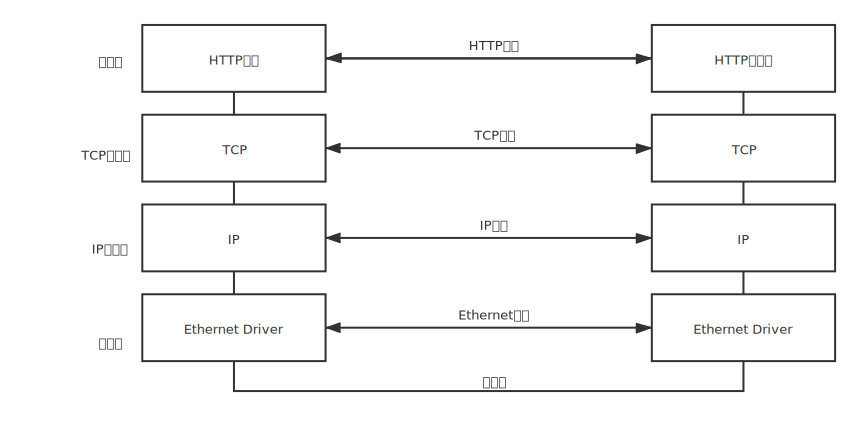

> 读 《TCP-IP详解·协议》 笔记

# 概述

## 1.分层

网络协议通常分不同层次进行开发，每一层分别负责不同的通信功能。一个协议族，比如 `TCP/IP`，是一组不同层次上的多个协议的组合。 `TCP/IP`通常被认为是一个四层协议系统:

1.**应用层**:负责处理特定的应用程序细节。几乎各种不同的 `TCP/IP` 实现都会提供下面这些通用的应用程序：• Telnet 远程登录。• FTP 文件传输协议。• SMTP 简单邮件传送协议。•SNMP 简单网络管理协议。•HTTP 超文本传输协议。

2.**运输层**：主要为两台主机上的应用程序提供端到端的通信。在`TCP/IP`协议族中，有两个互不相同的传输协议：TCP（传输控制协议）和 UDP（用户数据报协议）。TCP为两台主机提供高可靠性的数据通信。它所做的工作包括把应用程序交给它的数据分成合适的小块交给下面的网络层，确认接收到的分组，设置发送最后确认分组的超时时钟等。由于运输层提供了高可靠性的端到端的通信，因此应用层可以忽略所有这些细节。而另一方面，UDP则为应用层提供一种非常简单的服务。它只是把称作数据报的分组从一台主机发送到另一台主机，但并不保证该数据报能到达另一端。任何必需的可靠性必须由应用层来提供。这两种运输层协议分别在不同的应用程序中有不同的用途。

3.**网络层**，有时也称作互联网层，处理分组在网络中的活动，例如分组的选路。在`TCP/IP`协议族中，网络层协议包括 IP协议（网际协议），ICMP协议（Intern et互联网控制报文协议），以及IGMP协议（Internet组管理协议）

4.**链路层**，有时也称作数据链路层或网络接口层，通常包括操作系统中的设备驱动程序和计算机中对应的网络接口卡。它们一起处理与电缆（或其他任何传输媒介）的物理接口细节。

TCP/IP协议族分为四层：链路层、网络层、运输层和应用层，每一层各有不同的责任。在TCP/IP中，网络层和运输层之间的区别是最为关键的：网络层（IP）提供点到点的服务，而运输层（TCP和UDP）提供端到端的服务。

## 2.关系 
> 应用层关心的是应用程序的细节，而不是数据在网络中的传输活动。下三层对应用程序一无所知，但它们要处理所有的通信细节。

上图中列举了四种不同层次上的协议。
- 1.HTTP是一种应用层协议，
- 2.TCP是一种运输层协议，
- 3.IP是一种网络层协议，
- 4.以太网协议则应用于链路层上。

TCP/IP协议族是一组不同的协议组合在一起构成的协议族。尽管通常称该协议族为TCP/IP，但TCP和IP只是其中的两种协议而已（该协议族的另一个名字是Internet协议族(Internet Protocol Suite)）。

网络接口层和应用层的目的是很显然的—前者处理有关通信媒介的细节（以太网、令牌环网等），而后者处理某个特定的用户应用程序（HTTP,FTP等）。但是，从表面上看，网络层和运输层之间的区别不那么明显。为什么要把它们划分成两个不同的层次呢？为了理解这一点，我们必须把视野从单个网络扩展到一组网络。

## 3.组网

**路由器**
一个互连网就是一组通过相同协议族互连在一起的网络，构造互连网最简单的方法是把两个或多个网络通过路由器进行连接。它是一种特殊的用于网络互连的硬件盒。路由器的好处是为不同类型的物理网络提供连接：以太网、令牌环网、点对点的链接和FDDI（光纤分布式数据接口）等等。这些盒子也称作IP路由器（IP Router），但我们这里使用路由器( Router)这个术语。从历史上说，这些盒子称作网关（gateway），在很多TCP/IP文献中都使用这个术语。现在网关这个术语只用来表示应用层网关：一个连接两种不同协议族的进程（例如，TCP/IP和IBM的SNA），它为某个特定的应用程序服务（常常是电子邮件或文件传输）。

> 

上图是一个包含两个网络的互连网：一个以太网和一个令牌环网，通过一个路由器互相连接。尽管这里是两台主机通过路由器进行通信，实际上以太网中的任何主机都可以与令牌环网中的任何主机进行通信。**可以划分出端系统（End system）（两边的两台主机）和中间系统（Intermediate system）（中间的路由器）。应用层和运输层使用端到端（End - to - end）协议。在图中，只有端系统需要这两层协议。但是，网络层提供IP协议的却是逐跳（Hop - by - hop）协议，两个端系统和每个中间系统都要使用它。**

::: tip
因此在TCP/IP协议族中，网络层IP提供的是一种不可靠的服务。也就是说**它只是尽可能快地把分组从源结点送到目的结点**，但是并不提供任何可靠性保证。而另一方面，**TCP在不可靠的IP层上提供了一个可靠的运输层**。为了提供这种可靠的服务，TCP采用了超时重传、发送和接收端到端的确认分组等机制（TCP的三次握手，和四次挥手）。由此可见，运输层和网络层分别负责不同的功能。
:::

::: warning
连接网络的另一个途径是使用**网桥**。网桥是在链路层上对网络进行互连，而路由器则是在网络层上对网络进行互连。网桥使得多个局域网（LAN）组合在一起，这样对上层来说就好像是一个局域网。TCP /IP倾向于使用路由器而不是网桥来连接网络。
:::

### 3.1 IP 分类
互联网上的每个接口必须有一个唯一的 Internet地址（也称作 IP地址）。IP地址长 32 bit。（4个字节大小）Internet地址并不采用平面形式的地址空间，如 1、2、3等。 P地址具有一定的结构，五类不同的互联网地址格式

### 3.2 域名
管通过IP 地址可以识别主机上的网络接口，进而访问主机，但是人们最喜欢使用的还是主机名。在 TCP/IP领域中，域名系统（DNS）是一个分布的数据库，由它来提供 IP 地址和主机名之间的映射信息

## 4.封装
当应用程序用 TCP传送数据时，数据被送入协议栈中，然后逐个通过每一层直到被当作一串比特流送入网络。其中每一层对收到的数据都要增加一些首部信息（有时还要增加尾部信息），该过程如图下图所示。**TCP传给IP的数据单元称作 TCP报文段或简称为 TCP段（TCP segment）。IP传给网络接口层的数据单元称作IP数据报(IP datagram)。通过以太网传输的比特流称作帧(Frame )。** **UDP数据与TCP数据基本一致。唯一的不同是 UDP传给 IP的信息单元称作 UDP数据报（UDP datagram），而且UDP的首部长为8字节。**

## 5.分用
当目的主机收到一个以太网数据帧时，数据就开始从协议栈中由底向上升，同时去掉各层协议加上的报文首部。每层协议盒都要去检查报文首部中的协议标识，以确定接收数据的上层协议。这个过程称作分用。 

### 5.1 端口号
**TCP和UDP采用16bit (2字节)的端口号来识别应用程序**
服务器一般都是通过知名端口号来识别的。例如，对于每个 TCP/IP实现来说，FTP服务器的TCP端口号都是21，每个Telnet服务器的TCP端口号都是23，每个TFTP (简单文件传送协议)服务器的**UDP端口号都是69**。任何TCP/IP实现所提供的服务都用知名的 1～1023之间的端口号。 知名端口号介于1～255之间。256～1023之间的端口号通常都是由Unix系统占用，以提供一些特定的Unix服务—也就是说，提供一些只有Unix系统才有的、而其他操作系统可能不提供的服务。现在IANA管理1～1023之间所有的端口号。  这些知名端口号由 Internet号分配机构（Internet Assigned Numbers Authority, IANA）来管理,大多数TCP / IP实现给临时端口分配 1024～5000之间的端口号。大于 5000的端口号是为其他服务器预留的（Internet上并不常用的服务)

### 5.2 标准化
是谁控制着 TCP / IP协议族，又是谁在定义新的标准以及其他类似的事情？、
-  Internet协会（ISOC，Internet Society）是一个推动、支持和促进 Internet不断增长和发展的专业组织，它把Internet作为全球研究通信的基础设施。
-  Internet体系结构委员会（IAB，Internet Architecture Board）是一个技术监督和协调的机构，IAB隶属于ISOC，其职能是负责 Internet标准的最后编辑和技术审核
-  Internet工程专门小组（IETF，Internet Engineering Task Force）是一个面向近期标准的组织
-  Internet研究专门小组（IRIF，Internet Research Task Force）主要对长远的项目进行研究。
-  IRTF和IETF都隶属于IAB。
### 5.3 互联网
internet这个词第一个字母是否大写决定了它具有不同的含义。internet意思是用一个共同的协议族把多个网络连接在一起。而 Internet指的是世界范围内通过TCP / IP互相通信的所有主机集合（超过 100万台）。Internet是一个internet，但internet不等于Internet。

## 6.链路层
**链路层的作用** TCP/IP支持多种不同的链路层协议，这取决于网络所使用的硬件设备（网卡驱动）
- 为IP模块发送和接收IP数据报;
- 为ARP模块发送ARP请求和接收ARP应答
- 为RARP发送RARP请求和接收RARP应答

### 6.1 以太网
