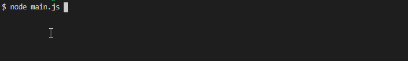
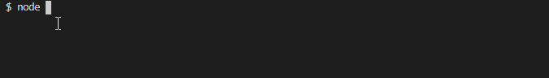

## Cli 控制台显示加载进度，并输出成功以及失败的状态

::: tip
最近 CLI 项目中有一个用户体验不是很完美点的，因为需要执行 cli 命令来发送一个请求到服务器，虽然请求发送成功了，但是服务器需要做一些规则操作，这些规则操作的时间，没有办法捕获到并且响应给 cli 中，思来想去，采取了一个障眼法的操作，哈哈哈
:::

## 效果图

:biking_man: **success**



:biking_man: **failed**



::: tip
首先来看进度条的代码 相对来说比较简单，主要的作用就是计算输出 完成的字符和未完成的字符拼接返回的整字串，以及完成的百分比
:::

## 分析

```js
// TerminalProgress.js
class TerminalProgress {
  constructor(description) {
    // the description info 进度条前面的描述
    this.description = description || "OnProgress";
    // the render str length 进度条的长度（这玩意最好别太长，超过控制台长度输出就略显有点bug）
    this.length = 50;
  }
  /**
   * @Parmas opts {Object}
   * @Parmas opts.completed {Number}
   * @Parmas opts.total {Number}
   *
   * @return Result {Object}
   * @return Result.description {String}
   * @return Result.complete    {String}
   * @return Result.uncomplete  {String}
   * @return Result.progressNum {Number}
   */

  renderOption(opts) {
    // Calculate progress (completed / total)
    let percent = (opts.completed / opts.total).toFixed(4);
    // the complete str length
    let cell_num = Math.floor(percent * this.length);

    // complete str
    let complete = "";
    for (let i = 0; i < cell_num; i++) {
      complete += "█";
    }

    // uncompleted str
    let uncomplete = "";
    for (let i = 0; i < this.length - cell_num; i++) {
      uncomplete += "░";
    }
    //
    let progressNum = `${(100 * percent).toFixed(2)}%`;

    return { description: this.description, complete, uncomplete, progressNum };
  }
}

module.exports = TerminalProgress;
```

::: tip
有了上面的进度串，就要思考这个东西应该运行在哪里</br>
1、直接在主进程中运行先加载完进度串再发送请求-这个做法简直了 enenene, 发送请求失败了怎么办？，提示用户执行成功了，但是后面又失败，心口不一啪啪打脸 ✖ 😂😂😂 </br>
2、运行在子进程中，主进程加载子进程运行进度串，然后主进程在去发送请求，请求发送成功，主进程通过进程通信告诉子进程，这个你就顺利执行完成就 OK，如果发送失败，在告诉子进程这个不 OK，见红。</br>
3、执行 main 主进程 加载子进程输出进度串，并且主进程设置定时器，在一定的时间以后 发起请求并判断 响应是否 OK 如果 OK，在此向子进程 send 数据。
:::

```js
// child_process.js
let chalk = require("chalk"); // 颜色模块
let slog = require("single-line-log").stdout; // 输出字符在一行
const TerminalProgress = require("./TerminalProgress"); // 导入进度串 并实例化
const terminalProgress = new TerminalProgress("On Publishing");
var Timer = null;

// 子进程监听 message 事件
process.on("message", (value) => {
  render(value);
});

function render(value) {
  let num = value.num;
  let total = value.total;
  let status = value.status;
  let time = value.time;
  if (Timer) {
    clearInterval(Timer);
  }
  Timer = setInterval(() => {
    if (num <= total) {
      let {
        description,
        complete,
        uncomplete,
        progressNum,
      } = terminalProgress.renderOption({ completed: num, total: total });
      if (status) {
        let renderString = `${description}: ${chalk.green(
          complete
        )}${uncomplete}  ${progressNum} \n\n`;
        slog(renderString);
      } else {
        let renderString = `${description}: ${complete}${uncomplete}  ${progressNum} \n\n`;
        slog(chalk.red(renderString));
      }
      num++;
    } else {
      clearInterval(Timer);
      // 退出当前进程
      process.exit(status);
    }
  }, time);
}
```

::: tip
主进程代码
:::

```js
// main.js
const path = require("path");
const chalk = require("chalk");
const child_process = require("child_process");
console.log(" ");

let buildTime = 300; //
let publishTime = parseInt(Date.now() / 1000);
let leadTime = buildTime - publishTime < 0 ? 180 : buildTime - publishTime;
let thirtyPercentTime = leadTime * 0.3;
let countDownTime = 500;

let pathString = path.resolve(__dirname, "./child_process.js");
// fork 一个子进程并加载运行
const subprocess = child_process.fork(pathString);
// 想子进程发送初始化数据
subprocess.send({ num: 0, total: leadTime, status: true, time: countDownTime });
// 监听子进程的运行状态
subprocess.on("close", async (value) => {
  if (value) {
    console.log(chalk.green(`发布成功`));
  } else {
    console.log(chalk.red("发布失败"));
  }
  process.exit(0);
});

let setFunction = async (count) => {
  let isPublishOK = await asyncRequest();
  if (isPublishOK) {
    subprocess.send({
      num: parseInt(leadTime * (count / 10)),
      total: leadTime,
      status: true,
      time: 100,
    });
  } else {
    if (count == 6) {
      subprocess.send({
        num: parseInt(leadTime * (count / 10)),
        total: leadTime,
        status: false,
        time: 50,
      });
    } else {
      setTimeout(setFunction, thirtyPercentTime * countDownTime, 6);
    }
  }
};

setTimeout(setFunction, thirtyPercentTime * countDownTime, 3);

async function asyncRequest() {
  // do something
  return true;
}
```

## 延伸

:::
除过使用子进程还可以使用 woker 线程，来加载运行进度串
:::

```js
// Woker.js
let slog = require("single-line-log").stdout;
let chalk = require("chalk");
// 使用了 这个库
const { parentPort, workerData } = require("worker_threads");
const TerminalProgress = require("./TerminalProgress");
const terminalProgress = new TerminalProgress("On Publishing", workerData - 30);
var Timer = null;
parentPort.on("message", (value) => {
  render(value);
});

function render(value) {
  let num = value.num;
  let total = value.total;
  let status = value.status;
  let time = value.time;
  if (Timer) {
    clearInterval(Timer);
  }

  Timer = setInterval(() => {
    if (num <= total) {
      let {
        description,
        complete,
        uncomplete,
        progressNum,
      } = terminalProgress.renderOption({ completed: num, total: total });
      if (status) {
        let renderString = `${description}: ${chalk.green(
          complete
        )}${uncomplete}  ${progressNum} \n\n`;
        slog(renderString);
      } else {
        let renderString = `${description}: ${complete}${uncomplete}  ${progressNum} \n\n`;
        slog(chalk.red(renderString));
      }

      num++;
    } else {
      clearInterval(Timer);
      parentPort.postMessage(status);
      process.exit(0);
    }
  }, time);
}
```

```js
// main.js
// .... 省略 ....
let pathString = path.resolve(__dirname, "./Woker.js");
const worker = new Worker(pathString, { workerData: process.stdout.columns });
worker.postMessage({
  num: 0,
  total: leadTime,
  status: true,
  time: countDownTime,
});
worker.on("message", (value) => {
  if (value) {
    console.log(chalk.green(`成功`));
  } else {
    console.log(chalk.red("失败"));
  }
  process.exit(0);
});
// .... 省略 ....
```
